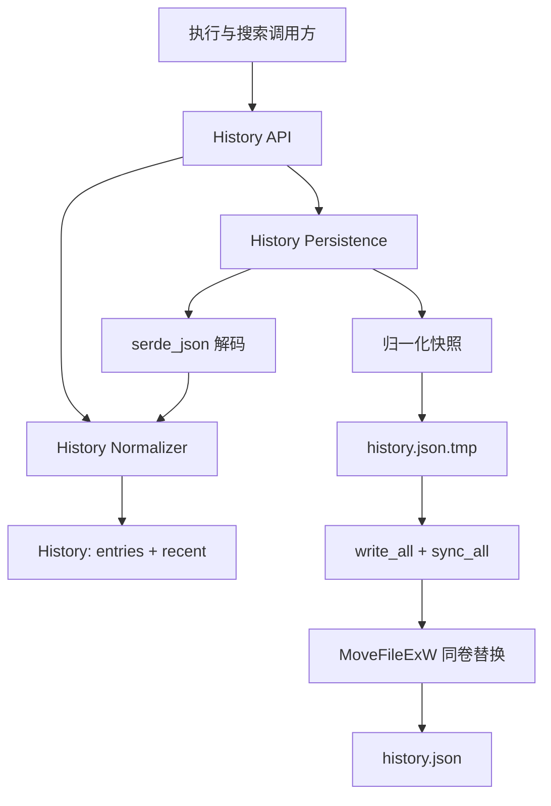

# 设计文档：有界历史持久化

## 概述

本设计收紧 `crates/app/src/search/history.rs` 中 `History` 的数据边界和提交语义，不改变调用方可见的频次 boost 分段。`History` 仅保留 `entries` 与 `recent`；加载、记录和保存均通过同一套确定性归一化规则，使内存状态和磁盘状态收敛到 `entries <= 1000`、`recent <= 20`。

实现继续使用现有 `serde`、`serde_json` 和目标平台已有的 `windows` crate，不引入新的第三方依赖。持久化仍为 best-effort、non-fatal：公开的 `load()` 在任何读取或解析失败时返回空且已归一化的历史，公开的 `save()` 不把失败传播到 UI 或执行流程；内部辅助函数保留 `io::Result`，以便测试和诊断失败路径。

### 设计目标

- 删除 `pinned` 数据和相关 API，同时让旧 JSON 的未知 `pinned` 字段自然兼容。
- 对频次表和最近列表实施固定容量及确定性保留规则。
- 新 `action_key` 插入满表时受到本次归一化保护，保证新键至少进入历史一次。
- 保存前对快照归一化，避免序列化未受约束的内存状态。
- 在 Windows 上使用同目录固定临时文件 `history.json.tmp` 和单步替换，避免“先删旧文件再改名”的破坏窗口。
- 将临时文件数量限制为一个，并在加载及提交入口清理陈旧临时文件。

### 非目标

- 不改变 boost 桶、最近项目展示方向或 `history.json` 之外的持久化格式。
- 不为所有项目持久化模块建立通用存储框架；项目级容量原则在本特性中仅落实到 History。
- 不提供跨进程并发写入协调。EasySearch 当前由单一应用进程拥有该文件；若未来允许多个写入者，应另行定义锁和冲突合并语义。

## 调研结论

1. Rust `std::fs::rename` 文档说明 Windows 后端可能使用 `MoveFileExW` 或 `SetFileInformationByHandle`，且目标存在时的行为依赖操作系统与文件系统能力。即使当前 Rust API描述为可替换目标，它也不允许调用方要求 `WRITE_THROUGH`、选择替换标志或区分 Windows 共享模式/删除权限导致的替换失败。因此本设计不把通用 `rename` 当作 Windows 持久提交保证，也绝不采用“删除 `history.json` 后再 rename”的回退方案。
2. Windows `MoveFileExW` 的 `MOVEFILE_REPLACE_EXISTING` 可在目标存在时替换文件，`MOVEFILE_WRITE_THROUGH` 要求移动操作完成后再返回。临时文件与目标位于同一目录，可排除跨卷复制回退，并在本地 NTFS 等支持同卷重命名替换的文件系统上获得原子替换语义；其他文件系统、共享模式、ACL 或异常平台条件下只能提供尽可能原子语义，失败必须保留旧目标并作为非致命保存失败处理。
3. `ReplaceFileW` 专门用于替换已有文件并保留部分元数据，但其文档列出的部分失败码可能使无备份调用的旧目标名称消失；增加备份文件又违反“最多一个固定临时文件”的边界。因此本设计选择单个同目录临时文件加 `MoveFileExW(REPLACE_EXISTING | WRITE_THROUGH)`，而不使用无备份 `ReplaceFileW`。
4. `File::sync_all` 可在替换前要求临时文件的数据和元数据向存储层同步。Windows 没有与 Unix 目录 `fsync` 完全等价且适合这里的稳定 std 接口，所以设计承诺“临时文件先同步 + 写穿透同卷替换”，不宣称对所有硬件断电场景提供绝对持久性。

参考资料：

- Rust `std::fs::rename`：https://doc.rust-lang.org/std/fs/fn.rename.html
- Microsoft `MoveFileExW`：https://learn.microsoft.com/en-us/windows/win32/api/winbase/nf-winbase-movefileexw
- Microsoft `ReplaceFileW`：https://learn.microsoft.com/en-us/windows/win32/api/winbase/nf-winbase-replacefilew

## 架构



职责仍集中在小型 `history` 领域模块，不向 `window.rs` 添加业务逻辑。为提高可测试性，文件路径和 I/O 操作由私有辅助函数接收 `&Path`，公开 `load()`/`save()` 仅负责默认路径与 best-effort 策略。

### 归一化管线

归一化严格按以下顺序执行，顺序本身是设计不变量：

1. **最近列表去重**：从尾到头扫描 `recent`，每个 `action_key` 仅保留最后出现的完整 `RecentItem`；然后反转保留结果，恢复这些最后出现项原有的相对时间顺序。
2. **最近列表截断**：若去重后超过 20 项，删除最前端最早项，仅保留末尾最新 20 项。
3. **近期集合建立**：从已去重且已截断的 `recent` 产生 `HashSet<&str>`。只有最终最近列表成员享有频次表的“近期项目”优先级。
4. **频次表选择**：若 `entries` 超过 1000，按以下比较键排序：
   - `action_key` 是否属于近期集合：成员在前；
   - `count`：降序；
   - `action_key`：Unicode 标量值字典序升序。
5. **受保护新键**：记录一个原先不存在的 `action_key` 时，归一化接收 `protected_action_key = Some(key)`。如果表超限，先保留该键，再从上述有序候选中选择最多 999 个其他键。加载、保存和更新已有键时不设置保护键，使用完整的普通保留顺序。
6. **重建频次表**：从选中键重建 `HashMap`。JSON 对象字段输出顺序不作为文件字节确定性保证；确定性要求针对归一化后的键值集合。若未来需要字节级稳定输出，应单独改用有序序列化表示。

Rust `String::cmp` 对合法 UTF-8 字符串的字节字典序保持 Unicode 标量值顺序，因此可作为 `action_key` 的最终比较器；不执行大小写折叠、区域化排序或 Unicode 规范化。

## 组件和接口

### `History`

```rust
#[derive(Debug, Clone, Default, Serialize, Deserialize)]
struct History {
    entries: HashMap<String, u32>,
    #[serde(default)]
    recent: Vec<RecentItem>,
}
```

- 删除 `pinned` 字段以及 `pin`、`unpin`、`is_pinned`、`pinned_position`。
- 不启用 `deny_unknown_fields`。Serde 默认忽略未知 JSON 对象字段，因此旧文件顶层 `pinned` 被忽略，后续序列化也不会重新写出。
- `entries` 保持当前必需字段语义；不受支持或不可解析的文档由外层加载策略整体降级为空历史。

### `History_Normalizer`

建议的私有接口：

```rust
fn normalize(&mut self, protected_action_key: Option<&str>);
```

- `None` 用于加载、保存快照及已有键更新。
- `Some(key)` 仅用于本次 `record` 前确认 `key` 原先不存在的情况。
- 归一化是幂等操作；对已归一化状态再次调用不会改变逻辑内容。
- `record_full` 先执行计数记录，再以相同 `action_key` 替换最近项并追加到尾部，最后执行一次完整归一化。实现应避免在内部 `record` 已归一化后丢失“新键”保护信息，可由共享私有 `record_count` 返回 `was_new`，再在完整元数据写入后统一归一化。

### `History_Store`

- `record(key)`：使用 `HashMap::entry` 判断新旧键，以 `saturating_add(1)` 更新计数，再调用归一化；新键传入保护参数。
- `record_full(...)`：更新计数；删除 `recent` 中所有同键项；将最新元数据追加到尾部；调用归一化并传递新键保护状态。
- `top_recent(n)`：保持现有“存储最旧到最新、返回最新到最旧”行为。
- `count(key)` 与 `boost_score(key)`：保持既有接口和桶映射不变。

### `History_Persistence`

建议的内部接口边界：

```rust
fn load_from(path: &Path) -> io::Result<History>;
fn save_to(path: &Path, history: &History) -> io::Result<()>;
fn replace_history_file(temp: &Path, target: &Path) -> io::Result<()>;
fn remove_stale_temp(temp: &Path);
```

公开接口保持调用方简单：

- `History::load() -> History`：调用 `load_from`；任意错误返回 `History::default()`，默认值再经过归一化。
- `History::save(&self)`：调用 `save_to` 并忽略返回错误，保持执行路径 non-fatal。内部 `Result` 可在单元测试中断言。

### 加载流程

1. 计算 `history.json` 和同目录 `history.json.tmp`。
2. best-effort 删除陈旧固定临时文件；删除失败不删除或覆盖正式文件，也不阻止读取正式文件。
3. 读取并解析正式文件。
4. 对解析结果调用 `normalize(None)` 后返回。
5. 文件不存在、读取失败或解析失败时，由公开层返回空历史。临时文件永不作为恢复源，避免把未提交数据误认作已提交版本。

### 保存与替换流程

1. 创建目标目录；失败则本次保存结束，正式文件不变。
2. best-effort 删除陈旧的 `history.json.tmp`。若临时路径仍存在或无法重新创建，则保存失败，正式文件不变。
3. 克隆内存 `History` 为保存快照，并执行 `snapshot.normalize(None)`；不依赖调用方已经维持不变量，也不为保存修改 `&self`。
4. 将快照序列化为内存中的完整 JSON 字节。序列化失败时尚未触碰正式文件。
5. 使用固定临时路径以 `create_new(true)` 创建文件，避免跟随或截断清理失败后残留的路径；写入全部字节，调用 `sync_all()`，然后关闭句柄。
6. Windows 上调用 `MoveFileExW(temp, target, MOVEFILE_REPLACE_EXISTING | MOVEFILE_WRITE_THROUGH)`。两个路径同目录，因此不设置 `MOVEFILE_COPY_ALLOWED`。
7. 替换成功后临时路径已消失，`history.json` 为完整新文档。替换失败时不删除正式文件；best-effort 删除临时文件，并返回内部错误。
8. 非 Windows 测试构建可使用同目录 `std::fs::rename` 作为平台辅助实现，但产品承诺和 Windows 验证以 Win32 路径为准。

固定临时名意味着保存不支持并发提交；应用当前单写入者模型满足该前提。`create_new` 将意外并发变成非致命失败，而不是两个写入者交错覆盖同一临时文件。

## 数据模型

### `RecentItem`

| 字段 | 类型 | 规则 |
|---|---|---|
| `title` | `String` | 保留最后出现项的值 |
| `subtitle` | `String` | 保留最后出现项的值 |
| `icon` | `String` | 保留最后出现项的值 |
| `action_key` | `String` | 最近列表去重键 |
| `is_directory` | `bool` | 缺失时默认 `false` |

### `History`

| 字段 | 类型 | 不变量 |
|---|---|---|
| `entries` | `HashMap<String, u32>` | 不超过 1000 个键；计数饱和于 `u32::MAX` |
| `recent` | `Vec<RecentItem>` | 不超过 20 个不同键；最旧在前、最新在后 |

### 磁盘文件集合

| 路径 | 角色 | 数量约束 |
|---|---|---|
| `%LOCALAPPDATA%\EasySearch\history.json` | 上次成功提交的正式文件 | 最多 1 个 |
| `%LOCALAPPDATA%\EasySearch\history.json.tmp` | 当前提交或陈旧提交的固定临时文件 | 最多 1 个 |

归一化不要求 `recent` 的每个键都存在于 `entries`，因为旧数据可能缺少对应计数；近期优先级只作用于确实存在于 `entries` 的键。记录完整项目时仍会同步建立或更新计数。

## 正确性属性

*属性是在系统所有有效执行中都应成立的特征或行为，本质上是关于系统应做什么的形式化陈述。属性连接了人类可读规范与机器可验证的正确性保证。*

以下属性已经过冗余反思：容量后置条件合并为一个属性；频次选择与确定性合并为参考模型属性；最近列表截断与稳定去重合并；当前格式保存、容量和 `pinned` 省略合并；boost 各分段合并为单一映射属性。Windows 文件替换和故障阶段不伪装成纯属性，而放入集成验证。

### 属性 1：记录操作维持有界且唯一的历史

对于任意 `History` 和任意 `record` 或 `record_full` 操作序列，每次操作返回后，`entries` 的键数不超过 1000，`recent` 的不同 `action_key` 数不超过 20，并且 `recent` 中每个 `action_key` 最多出现一次。

**验证：需求 2.1、2.2、2.5**

### 属性 2：已有计数执行饱和递增

对于任意已存在的 `action_key` 和任意 `u32` 计数，记录一次后的计数等于原计数的 `saturating_add(1)`。

**验证：需求 2.3**

### 属性 3：完整记录更新最新元数据

对于任意 `History` 和任意完整项目元数据，调用 `record_full` 后，最近列表恰好包含一个对应 `action_key`，该项位于最新位置并包含本次提供的元数据。

**验证：需求 2.4**

### 属性 4：频次表选择等同确定性参考模型

对于任意频次表、任意近期项目集合以及任意等价的 `HashMap` 插入顺序，`normalize(None)` 选出的最多 1000 个键值对等同于按“近期成员优先、count 降序、action_key Unicode 标量值升序”排序后取前 1000 项的参考模型，且各插入顺序产生相同键值集合。

**验证：需求 3.1、3.2、5.2**

### 属性 5：满表记录保护新键

对于任意恰含 1000 个键的频次表和任意不在表中的新 `action_key`，记录新键后频次表仍恰含 1000 个键，并包含该新 `action_key`。

**验证：需求 3.3**

### 属性 6：最近列表稳定去重并保留最新 20 项

对于任意最近项目序列，归一化结果等同于“从尾到头保留每个 `action_key` 的第一次出现、反转恢复相对顺序、再取末尾最多 20 项”的参考模型。

**验证：需求 3.4、5.3、5.4**

### 属性 7：boost 映射保持既有分段

对于任意 `u32` 执行计数，`boost_score` 等于参考映射：0→0、1..=2→20、3..=9→40、10..=29→60、30..=99→80、100..=u32::MAX→100。

**验证：需求 4.1、4.2、4.3、4.4、4.5、4.6**

### 属性 8：旧 `pinned` 字段不影响受支持数据

对于任意可序列化的受支持历史字段和任意合法 JSON `pinned` 值，加载带有 `pinned` 的文档与加载删除该字段后的文档产生相同的归一化 `entries` 和 `recent`。

**验证：需求 1.3**

### 属性 9：保存产生当前有界格式

对于任意可序列化的内存 `History`，成功保存后的 JSON 不包含顶层 `pinned` 字段，`entries` 不超过 1000 项，`recent` 不超过 20 个不同键，并且再次加载保持相同的归一化逻辑内容。

**验证：需求 1.2、2.6、5.6**

### 属性 10：临时路径固定且同目录

对于任意合法的 `history.json` 目标路径，派生的临时路径与目标具有相同父目录，文件名恒为 `history.json.tmp`。

**验证：需求 6.3、6.6**

## 错误处理

| 失败点 | 对外行为 | 正式文件保证 | 临时文件处理 |
|---|---|---|---|
| 目录创建失败 | `save()` 非致命返回 | 不触碰旧文件 | 无新临时文件 |
| JSON 序列化失败 | `save()` 非致命返回 | 不触碰旧文件 | 无新临时文件 |
| 陈旧临时文件无法清理/占用 | `save()` 非致命返回 | 不触碰旧文件 | 保留现场，等待下次 best-effort 清理 |
| 临时文件创建、写入或同步失败 | `save()` 非致命返回 | 不触碰旧文件 | 关闭后 best-effort 删除固定临时文件 |
| Windows 替换失败 | `save()` 非致命返回 | 不主动删除、截断或改名旧文件 | best-effort 删除固定临时文件 |
| 正式文件缺失、不可读或 JSON 不受支持 | `load()` 返回空归一化 History | 不修改正式文件 | 加载入口 best-effort 清理陈旧临时文件 |
| 陈旧临时文件清理失败但正式文件可读 | 继续读取正式文件 | 不修改正式文件 | 保留，后续入口重试清理 |

“保留旧文件”的实现约束是：替换前禁止对 `history.json` 执行 `remove_file`、截断写或中间备份改名。所有可能失败的数据生成和落盘操作先作用于临时文件。对 `MoveFileExW` 自身无法消除的外部因素（杀毒软件独占、权限变化、非原子文件系统实现），操作失败即放弃本次保存；不得退化为先删后移。

异常退出阶段预期：

- 临时文件创建前、写入中或同步前退出：旧正式文件保持不变，可能留下一个固定临时文件；下次加载清理该文件。
- 临时文件同步后、替换前退出：旧正式文件保持不变，留下完整但未提交的固定临时文件；下次加载仍只信任旧正式文件并清理临时文件。
- 替换操作期间或之后退出：在支持同卷原子替换的 Windows 文件系统上，目录项指向旧或新完整文件；其他环境按“尽可能原子”处理，不能提供超出平台原语的保证。

## 测试策略

本特性包含纯归一化、排序、稳定去重、计数映射和序列化逻辑，适合属性测试；Windows 文件系统替换与异常阶段属于平台集成行为，不适合通过 100 次随机外部 I/O 验证。

### 属性测试

- 使用 Rust 的 `proptest` 库，而不是自行实现随机生成器；该依赖仅作为 `dev-dependency`。若项目希望严格零新增依赖，可改为确定性表驱动单元测试，但会降低大输入空间覆盖率，需要用户确认。
- 每个“正确性属性”对应一个独立属性测试，最少运行 100 个生成案例。
- 每个测试以注释标注：`Feature: bounded-history-persistence, Property N: <属性标题>`。
- 生成器覆盖空字符串、非 ASCII 与组合 Unicode `action_key`、相同计数、大量重复 recent、`u32::MAX`、999/1000/1001 边界和不同 `HashMap` 插入顺序。
- 文件 round-trip 属性使用隔离测试目录和内部 `save_to`/`load_from`，避免写入用户 `%LOCALAPPDATA%`。

### 单元测试

- 表驱动检查 boost 的每个边界值，作为属性测试之外易诊断的回归示例。
- 解析含未知 `pinned` 对象、数组、标量和 `null` 的旧 JSON，确认受支持字段加载。
- 检查缺失文件、无效 JSON、字段类型不受支持时返回空归一化历史。
- 检查保存快照归一化不修改调用方原 `History`。
- 检查固定临时路径构造、最近项目展示方向和 `is_directory` 缺省兼容。

### Windows 集成与故障注入

- 在临时目录预置可解析旧 `history.json`，成功保存后确认目标可完整解析、内容为新快照且临时文件消失。
- 在临时写入前、写入后、`sync_all` 后、替换前注入错误，逐阶段确认旧目标字节保持不变且 API 非致命返回。
- 通过占用临时路径或制造权限失败验证创建/替换失败路径；测试后仅允许存在正式文件与至多一个固定临时文件。
- 预置陈旧 `history.json.tmp`，分别执行加载和保存，验证入口清理行为以及正式文件始终优先。
- Windows 专用测试验证目标已存在时 `MoveFileExW(REPLACE_EXISTING | WRITE_THROUGH)` 路径，而不是仅测试 `std::fs::rename`。
- 异常退出的真实进程终止测试可作为高成本 Windows 集成测试：子进程在阶段栅栏处退出，父进程只接受旧或新完整 JSON。此测试不作为每次快速单元测试的必要条件。

### 验证范围与需求追踪

| 需求 | 设计/验证位置 |
|---|---|
| 1.1–1.3 | `History` 模型、Serde unknown-field 策略、属性 8–9、API 编译检查 |
| 2.1–2.6 | 归一化管线、Store 接口、属性 1–3、9 |
| 3.1–3.4 | 确定性比较键、受保护新键、属性 4–6 |
| 4.1–4.6 | `boost_score` 保持不变、属性 7、边界单元测试 |
| 5.1–5.6 | 加载流程、稳定去重、旧格式 round-trip、属性 4、6、8–9 |
| 6.1–6.6 | 保存与替换流程、错误处理表、属性 10、Windows 集成与故障注入 |
| 7.1–7.4 | 明确容量、确定性淘汰、非目标与本表；实现验证范围仅 History/history.json |

### 验证出口标准

- 所有纯逻辑属性至少 100 案例通过，且每个属性与设计编号一一对应。
- 现有 History 单元测试在删除 pinned 测试后更新并通过；boost 与最近项调用方行为无回归。
- Windows 目标已存在替换、陈旧临时文件清理和替换失败保旧文件的集成测试通过。
- 代码审查确认没有 `remove(history.json) -> rename(temp)` 回退、没有动态临时文件名、没有新增运行时依赖、没有修改 History/history.json 之外的持久化实现。

## 设计决策摘要

1. 使用单一幂等归一化器覆盖 load、record 和 save 快照，防止各路径规则漂移。
2. `recent` 先稳定去重和截断，再决定 entries 的近期成员优先级，消除超限旧 recent 对淘汰结果的歧义。
3. 新键通过单次 `protected_action_key` 机制保留；该保护不永久改变后续普通归一化顺序。
4. 旧 `pinned` 依赖 Serde 默认 unknown-field 兼容，当前模型完全移除该字段，因此新 JSON 自然省略。
5. Windows 提交使用 `File::sync_all` 后的 `MoveFileExW(REPLACE_EXISTING | WRITE_THROUGH)`；明确拒绝先删除正式文件的通用 rename 回退。
6. 固定 `history.json.tmp`、`create_new` 和入口清理共同将文件数量限定为正式文件加至多一个临时文件。
7. 错误内部可观察、公开接口 non-fatal；失败不阻塞 UI，也不把未提交临时文件当作恢复数据。

## 待用户确认

1. 是否接受为测试添加仅开发期的 `proptest` 依赖？设计推荐接受；运行时依赖保持不变。若不接受，将以表驱动/参考模型单元测试替代属性测试库。
2. 是否接受持久化可靠性边界表述为“本地 Windows 同卷文件系统上原子、其他文件系统或外部干扰下尽可能原子”？平台 API 无法对所有文件系统、硬件断电和第三方独占给出绝对保证。
3. 当前设计假设单进程写入 `history.json`；是否需要把多进程并发写入纳入本特性？若需要，需求应先补充锁、等待时间和冲突策略。
